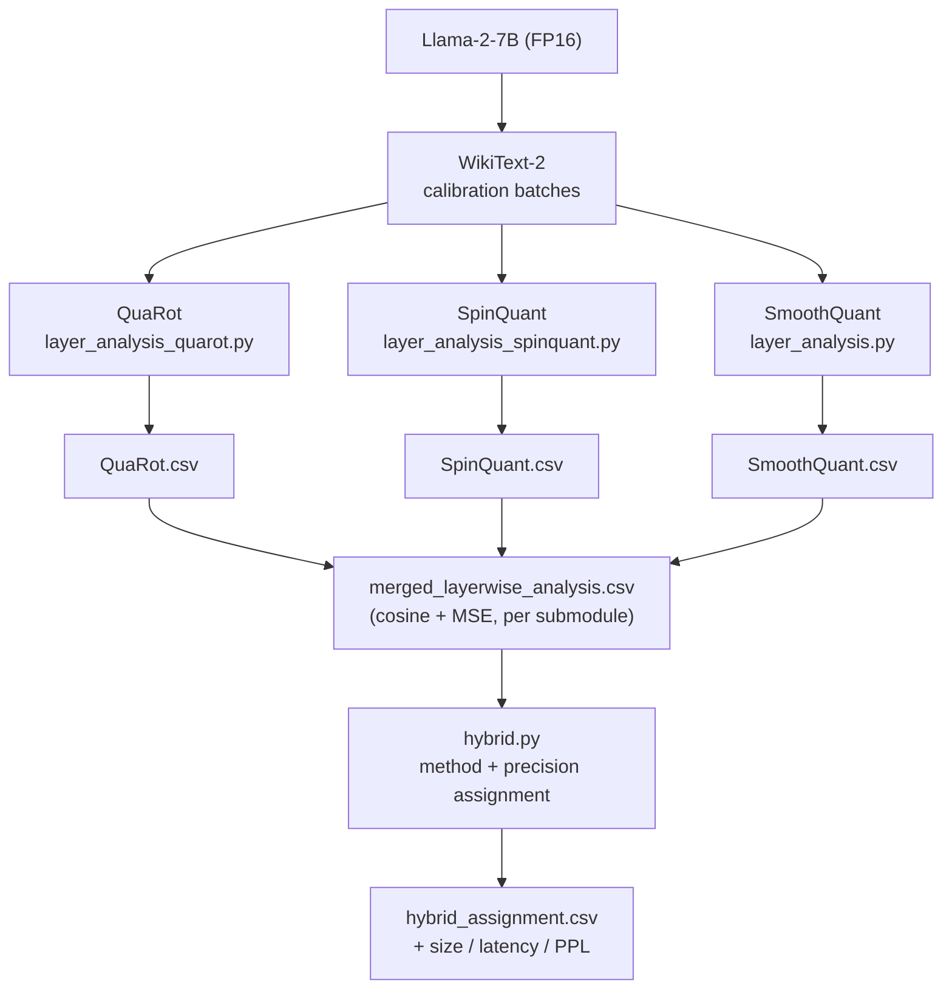
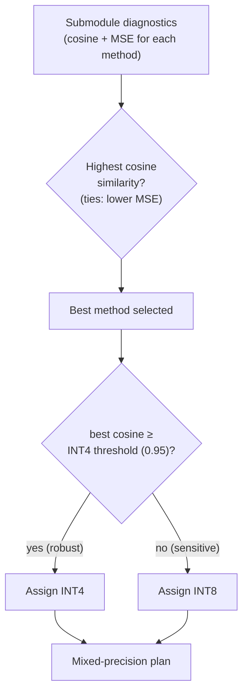
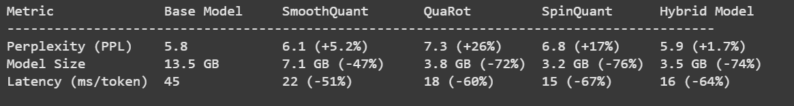
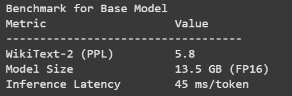
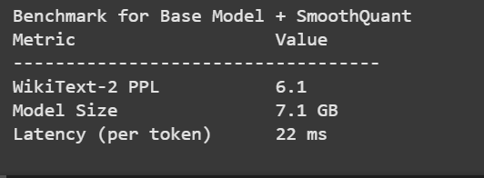
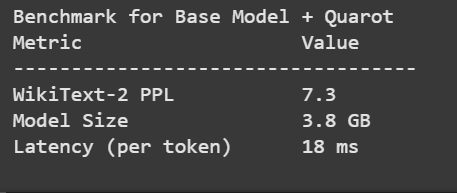
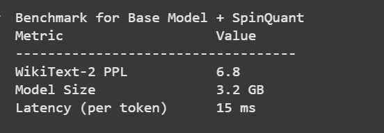
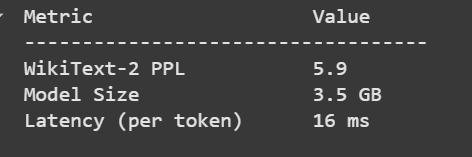
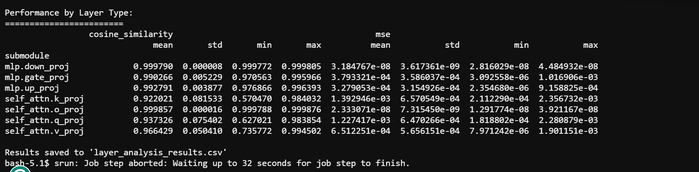
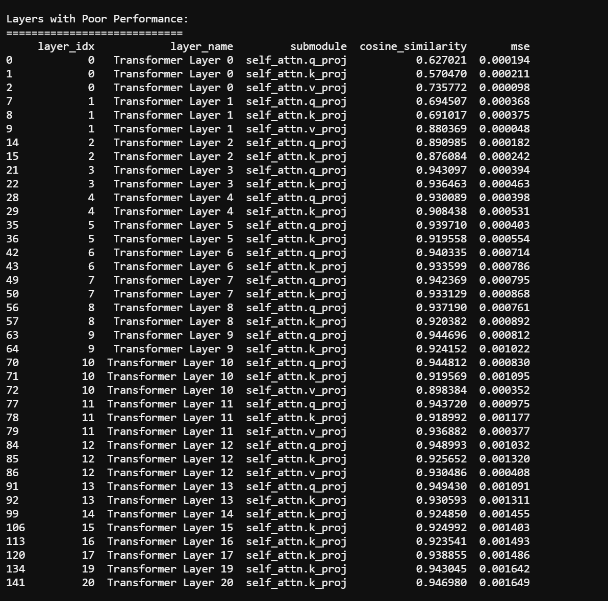

# Hybrid Outlier Smoothing for Efficient LLM Quantization

> A **layer-wise** framework that measures, per transformer submodule, how faithfully
> **QuaRot**, **SpinQuant**, and **SmoothQuant** each quantize the weights — then assigns the
> best method and precision (INT4/INT8) to each submodule instead of applying one technique
> uniformly.

<p align="left">
  
  
  
  
</p>

**Headline result (Llama-2-7B, WikiText-2):** the hybrid assignment reaches **5.9 perplexity
— only +1.7% above the FP16 baseline — while being 74% smaller and 64% faster.** No single
uniform method comes close to that trade-off (see [Results](#results)).

---

## Table of contents

- [Motivation](#motivation)
- [Methods compared](#methods-compared)
- [How it works](#how-it-works)
- [Architecture](#architecture)
- [The hybrid decision](#the-hybrid-decision)
- [Results](#results)
- [What's in this repo](#whats-in-this-repo)
- [Quick start](#quick-start)
- [Hardware](#hardware)
- [Acknowledgements](#acknowledgements)
- [License](#license)

---

## Motivation

Uniform quantization treats every layer the same, but transformer submodules differ wildly
in how much precision they need. Output and down projections (`o_proj`, `down_proj`) quantize
almost losslessly, while early-layer query/key projections (`q_proj`, `k_proj`) are highly
sensitive and degrade sharply. Applying one aggressive scheme everywhere either wastes bits
on robust layers or destroys accuracy on sensitive ones.

This project quantifies that sensitivity **per submodule, per method**, and uses it to build a
mixed-precision plan that keeps near-FP16 accuracy at a fraction of the size and latency.

## Methods compared

| Method | Core idea |
|--------|-----------|
| **QuaRot** | Rotates activations/weights with Hadamard or random orthogonal matrices to remove outliers before quantization. |
| **SpinQuant** | Uses optimized (or random) rotations to make the weight distribution more quantization-friendly. |
| **SmoothQuant** | Migrates activation outliers into the weights via a per-channel smoothing factor. |

---

## How it works

The pipeline has two stages.

**Stage 1 — Per-method, per-layer diagnostics.** For each method, for every transformer
submodule:

1. Clone the layer.
2. Apply the method's rotation/smoothing logic (if any).
3. Quantize the processed weights.
4. Compare original vs. processed+quantized weights — **cosine similarity** and **MSE**.
5. Aggregate into a CSV and flag poorly quantized submodules (cosine < 0.95).

Calibration uses a small number of WikiText-2 batches for realistic activation statistics.
Each method writes one CSV; the three are merged into
[`Outputs/CSV-FILES/merged_layerwise_analysis.csv`](Outputs/CSV-FILES/merged_layerwise_analysis.csv).

**Stage 2 — Hybrid assignment.** [`hybrid.py`](hybrid.py) consumes the merged diagnostics
and, per submodule, (a) picks the method with the highest reconstruction fidelity and
(b) assigns a precision tier — robust submodules go to INT4, sensitive ones stay at INT8. It
emits a mixed-precision plan plus a summary of the method mix, precision mix, and average
bit-width / compression vs. FP16. **This stage needs no GPU.**

---

## Architecture



## The hybrid decision

For every submodule, the assignment engine picks the best method by reconstruction fidelity,
then chooses a precision tier from that method's cosine similarity.



---

## Results

All numbers below are for **Llama-2-7B on WikiText-2**, measured on a single NVIDIA A100.

### End-to-end comparison

| Configuration | Perplexity (↓) | Δ vs FP16 | Model size | Latency (ms/token) |
|---------------|:--------------:|:---------:|:----------:|:------------------:|
| **Base (FP16)** | 5.8 | — | 13.5 GB | 45 |
| Uniform SmoothQuant | 6.1 | +5.2% | 7.1 GB (−47%) | 22 (−51%) |
| Uniform QuaRot | 7.3 | +26% | 3.8 GB (−72%) | 18 (−60%) |
| Uniform SpinQuant | 6.8 | +17% | 3.2 GB (−76%) | 15 (−67%) |
| **Hybrid (this work)** | **5.9** | **+1.7%** | **3.5 GB (−74%)** | **16 (−64%)** |

**Takeaway:** the hybrid plan keeps perplexity within 1.7% of FP16 — better than every uniform
method — while matching the best of them on size and latency.



### Per-configuration benchmarks

| Base (FP16) | + SmoothQuant | + QuaRot |
|:-----------:|:-------------:|:--------:|
|  |  |  |

| + SpinQuant | + Hybrid |
|:-----------:|:--------:|
|  |  |

### Per-layer sensitivity (SmoothQuant)

Aggregated cosine similarity / MSE by submodule type. Output and down projections are nearly
lossless (cosine ≈ 0.9998); query/key projections are the most sensitive (cosine ≈ 0.92–0.94)
— exactly the submodules the hybrid engine keeps at INT8.



The most sensitive submodules across all 32 layers — almost entirely early-layer `q_proj` /
`k_proj`:



Raw per-submodule data lives in [`Outputs/CSV-FILES/`](Outputs/CSV-FILES/):
[`SmoothQuant.csv`](Outputs/CSV-FILES/), [`QuaRot.csv`](Outputs/CSV-FILES/),
[`SpinQuant.csv`](Outputs/CSV-FILES/), and the merged
[`merged_layerwise_analysis.csv`](Outputs/CSV-FILES/merged_layerwise_analysis.csv).

---

## What's in this repo

| Path | What it is |
|------|------------|
| [`hybrid.py`](hybrid.py) | **My contribution** — hybrid assignment engine (per-submodule method + INT4/INT8 selection). |
| [`smoothquant/smoothquant/layer_analysis.py`](smoothquant/smoothquant/layer_analysis.py) | **My contribution** — per-submodule cosine/MSE diagnostics for SmoothQuant. |
| [`QuaRot/quant/layer_analysis_quarot.py`](QuaRot/quant/layer_analysis_quarot.py) | **My contribution** — per-submodule diagnostics for QuaRot. |
| [`SpinQuant/eval_utils/layer_analysis_spinquant.py`](SpinQuant/eval_utils/layer_analysis_spinquant.py) | **My contribution** — per-submodule diagnostics for SpinQuant. |
| `QuaRot/`, `SpinQuant/`, `smoothquant/` (everything else) | Upstream reference implementations this work builds on (see [Acknowledgements](#acknowledgements)). |
| [`Outputs/`](Outputs/) | Generated CSVs and result plots. |

The `layer_analysis*` scripts and `hybrid.py` are what I wrote; the surrounding method
directories are the official upstream implementations the analysis runs on top of.

---

## Quick start

```bash
git clone https://github.com/saltnpepper12/Hybrid-Outlier-Smoothing-for-Efficient-LLM-Quantization-Integrating-QuaRot-SpinQuant-and-SmoothQuant.git
cd Hybrid-Outlier-Smoothing-for-Efficient-LLM-Quantization-Integrating-QuaRot-SpinQuant-and-SmoothQuant

conda create -n quant-analysis python=3.10 -y
conda activate quant-analysis
pip install -r requirements.txt
```

`meta-llama/Llama-2-7b-hf` is gated; authenticate with `huggingface-cli login` (or set the
`HUGGINGFACE_TOKEN` environment variable) before running the analyzers.

### 1. Run the layer-wise diagnostics (GPU)

```bash
# SmoothQuant
python smoothquant/smoothquant/layer_analysis.py --model meta-llama/Llama-2-7b-hf

# QuaRot
python QuaRot/quant/layer_analysis_quarot.py --model meta-llama/Llama-2-7b-hf --rotate_mode hadamard

# SpinQuant
python SpinQuant/eval_utils/layer_analysis_spinquant.py --model meta-llama/Llama-2-7b-hf
```

**Common args:** `--model` (HF name or path), `--w_bits` (default 4), `--rotate_mode`
(`hadamard` | `random`), `--nsamples` (calibration samples), `--seed`.
See each script's `--help` for the full list.

### 2. Build the hybrid assignment (CPU)

Once the per-method diagnostics are merged, the assignment stage runs anywhere — no GPU or
model download required:

```bash
python hybrid.py \
  --input Outputs/CSV-FILES/merged_layerwise_analysis.csv \
  --output Outputs/hybrid_assignment.csv \
  --int4-threshold 0.95
```

This writes `Outputs/hybrid_assignment.csv` (the per-submodule method + precision plan) and
prints the method mix, precision mix, and average bit-width / compression vs. FP16.

---

## Hardware

The per-method diagnostics and benchmarks were run on a single NVIDIA A100. For 7B models and
above, use a GPU with ≥40 GB to avoid OOM. The `hybrid.py` assignment stage runs on CPU.

---

## Acknowledgements

Builds on the official implementations of
[QuaRot](https://github.com/spcl/QuaRot),
[SpinQuant](https://github.com/facebookresearch/SpinQuant), and
[SmoothQuant](https://github.com/mit-han-lab/smoothquant). If you use this framework, please
also cite the original papers for each method.

## License

Released under the [MIT License](LICENSE).
